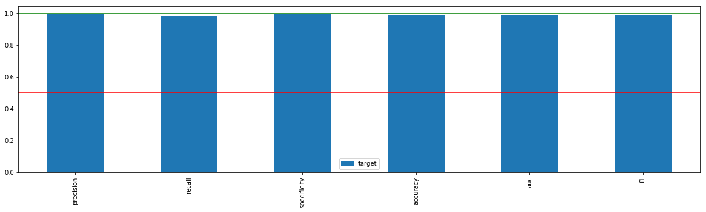

# Research Paper Classification for COVID-19 Research

There has been great momentum from the machine learning community to extract insights from the increasingly growing COVID-19 Datasets.

We believe the most powerful insights can be brought through cross-functional collaboration between infectious disease experts and machine learning practitioners. 

More importantly, once powerful predictive and explanatory models are built, it is especially important to be able to enable access to these models at scale.

In this small tutorial we will show how you can deploy your machine learning solutions at scale, and we will use a practical example with an on-going Kaggle dataset released by the Allen Institute for AI containing over 44,000 scholarly articles on COVID-19.

In this tutorial we will deploy a COVID-19 research paper classifier using Seldon Core, which will allow us to convert this ML model into a fully fledged microservice, which we'll be able to send REST / GRPC requests, as well as monitor through grafana / ELK integration.

## Tutorial Overview

In this tutorial we will showcase an end-to-end workflow that will ultimately show how to deploy a machine learning model - in this case we will be building a classifier that identifies whether a research paper is related to covid-19.

The steps in this tutorial include:

1) Train and build your NLP model

2) Build your containerized model

3) Test your model as a docker container

4) Run Seldon in your kubernetes cluster

5) Deploy your model with Seldon

6) Interact with your model through API

7) Clean your environment


### Before you start
Make sure you install the following dependencies, as they are critical for this example to work:

* Helm v3.0.0+
* A Kubernetes cluster running v1.13 or above (minkube / docker-for-windows work well if enough RAM)
* kubectl v1.14+
* Python 3.6+
* Python DEV requirements (we'll install them below)

Let's get started! 🚀🔥

## 1) Train and build your NLP model


```python
%%writefile requirements-dev.txt
scipy>= 0.13.3
scikit-learn>=0.18
spacy==2.0.18
dill==0.2.9
xai==0.0.5
alibi==0.4.0
```

    Writing requirements-dev.txt


```python
# Let's first install any dependencies
!pip install -r requirements-dev.txt
```


```python
import pandas as pd 
from sklearn.model_selection import train_test_split
import numpy as np
from sklearn.feature_extraction.text import TfidfVectorizer
from sklearn.linear_model import LogisticRegression
from seldon_core.seldon_client import SeldonClient
import dill
import sys, os
import xai

# This import may take a while as it will download the Spacy ENGLISH model
from ml_utils import CleanTextTransformer, SpacyTokenTransformer
```

    
        Linking successful
        /home/alejandro/miniconda3/lib/python3.7/site-packages/en_core_web_sm
        -->
        /home/alejandro/miniconda3/lib/python3.7/site-packages/spacy/data/en_core_web_sm
    
        You can now load the model via spacy.load('en_core_web_sm')
    


```python
arxiv_df = pd.read_csv("./data/arxiv-abstracts-2k.txt", names=["abstract", "is_covid"], delimiter= '\$\$\$')
arxiv_df.is_covid = [0]*2000
covid_df = pd.read_csv("./data/cord_19_2k.txt", names=["abstract", "is_covid"], delimiter= '\$\$\$')
covid_df.is_covid = [1]*2000
```

    /home/alejandro/miniconda3/lib/python3.7/site-packages/ipykernel_launcher.py:1: ParserWarning: Falling back to the 'python' engine because the 'c' engine does not support regex separators (separators > 1 char and different from '\s+' are interpreted as regex); you can avoid this warning by specifying engine='python'.
      """Entry point for launching an IPython kernel.
    /home/alejandro/miniconda3/lib/python3.7/site-packages/ipykernel_launcher.py:3: ParserWarning: Falling back to the 'python' engine because the 'c' engine does not support regex separators (separators > 1 char and different from '\s+' are interpreted as regex); you can avoid this warning by specifying engine='python'.
      This is separate from the ipykernel package so we can avoid doing imports until


```python
df = arxiv_df.append(covid_df)
```


```python
df.to_csv("./data/research_paper_abstracts.csv", index=False)
```


```python
df = pd.read_csv("./data/research_paper_abstracts.csv")
```


```python
df.tail()
```


<div>
<style scoped>
    .dataframe tbody tr th:only-of-type {
        vertical-align: middle;
    }

    .dataframe tbody tr th {
        vertical-align: top;
    }

    .dataframe thead th {
        text-align: right;
    }
</style>
<table border="1" class="dataframe">
  <thead>
    <tr style="text-align: right;">
      <th></th>
      <th>abstract</th>
      <th>is_covid</th>
    </tr>
  </thead>
  <tbody>
    <tr>
      <th>3995</th>
      <td>Abstract This article summarizes current knowl...</td>
      <td>1</td>
    </tr>
    <tr>
      <th>3996</th>
      <td>Abstract While epidemiological models have tra...</td>
      <td>1</td>
    </tr>
    <tr>
      <th>3997</th>
      <td>Abstract TGEV and PEDV are porcine coronavirus...</td>
      <td>1</td>
    </tr>
    <tr>
      <th>3998</th>
      <td>Abstract Metagenomics, i.e., the sequencing an...</td>
      <td>1</td>
    </tr>
    <tr>
      <th>3999</th>
      <td>Abstract Population genetic diversity plays a ...</td>
      <td>1</td>
    </tr>
  </tbody>
</table>
</div>


```python
# Let's see how many examples we have of each class
df["is_covid"].value_counts().plot.bar()
```


    <matplotlib.axes._subplots.AxesSubplot at 0x7fe4b53e6f90>


```python
x = df["abstract"].values
y = df["is_covid"].values
x_train, x_test, y_train, y_test = train_test_split(
    x, y, 
    stratify=y, 
    random_state=42, 
    test_size=0.1, shuffle=True)
```


```python
# Clean the text
clean_text_transformer = CleanTextTransformer()
x_train_clean = clean_text_transformer.transform(x_train)
```

    /home/alejandro/miniconda3/lib/python3.7/site-packages/ipykernel_launcher.py:29: DeprecationWarning: The unescape method is deprecated and will be removed in 3.5, use html.unescape() instead.


```python
# Tokenize the text and get the lemmas
spacy_tokenizer = SpacyTokenTransformer()
x_train_tokenized = spacy_tokenizer.transform(x_train_clean)
```


```python
# Build tfidf vectorizer
tfidf_vectorizer = TfidfVectorizer(
    max_features=10000,
    preprocessor=lambda x: x, 
    tokenizer=lambda x: x, 
    token_pattern=None,
    ngram_range=(1, 3))

tfidf_vectorizer.fit(x_train_tokenized)
```


    TfidfVectorizer(analyzer='word', binary=False, decode_error='strict',
            dtype=<class 'numpy.float64'>, encoding='utf-8', input='content',
            lowercase=True, max_df=1.0, max_features=10000, min_df=1,
            ngram_range=(1, 3), norm='l2',
            preprocessor=<function <lambda> at 0x7fe4b5902050>,
            smooth_idf=True, stop_words=None, strip_accents=None,
            sublinear_tf=False, token_pattern=None,
            tokenizer=<function <lambda> at 0x7fe4b58e6cb0>, use_idf=True,
            vocabulary=None)


```python
# Transform our tokens to tfidf vectors
x_train_tfidf = tfidf_vectorizer.transform(
    x_train_tokenized)
```


```python
# Train logistic regression classifier
lr = LogisticRegression(C=0.1, solver='sag')
lr.fit(x_train_tfidf, y_train)
```


    LogisticRegression(C=0.1, class_weight=None, dual=False, fit_intercept=True,
              intercept_scaling=1, max_iter=100, multi_class='warn',
              n_jobs=None, penalty='l2', random_state=None, solver='sag',
              tol=0.0001, verbose=0, warm_start=False)


```python
def predict_fn(x):
    x_c = clean_text_transformer.transform(x)
    x_s = spacy_tokenizer.transform(x_c)
    x_t = tfidf_vectorizer.transform(x_s)
    return lr.predict(x_t)
pred = predict_fn(x_test)
```

    The unescape method is deprecated and will be removed in 3.5, use html.unescape() instead.


```python
xai.metrics_plot(y_test, pred)
```


<div>
<style scoped>
    .dataframe tbody tr th:only-of-type {
        vertical-align: middle;
    }

    .dataframe tbody tr th {
        vertical-align: top;
    }

    .dataframe thead th {
        text-align: right;
    }
</style>
<table border="1" class="dataframe">
  <thead>
    <tr style="text-align: right;">
      <th></th>
      <th>target</th>
    </tr>
  </thead>
  <tbody>
    <tr>
      <th>precision</th>
      <td>0.994924</td>
    </tr>
    <tr>
      <th>recall</th>
      <td>0.980000</td>
    </tr>
    <tr>
      <th>specificity</th>
      <td>0.995000</td>
    </tr>
    <tr>
      <th>accuracy</th>
      <td>0.987500</td>
    </tr>
    <tr>
      <th>auc</th>
      <td>0.987500</td>
    </tr>
    <tr>
      <th>f1</th>
      <td>0.987406</td>
    </tr>
  </tbody>
</table>
</div>





## 2) Build your containerized model

First we need to export the trained models


```python
# These are the models we'll deploy
with open('tfidf_vectorizer.model', 'wb') as model_file:
    dill.dump(tfidf_vectorizer, model_file)
with open('lr.model', 'wb') as model_file:
    dill.dump(lr, model_file)
```

Now we write a class wrapper to expose the models


```python
%%writefile ResearchClassifier.py

import dill

from ml_utils import CleanTextTransformer, SpacyTokenTransformer

class ResearchClassifier(object):
    def __init__(self):
        
        self._clean_text_transformer = CleanTextTransformer()
        self._spacy_tokenizer = SpacyTokenTransformer()
        
        with open('tfidf_vectorizer.model', 'rb') as model_file:
            self._tfidf_vectorizer = dill.load(model_file)
           
        with open('lr.model', 'rb') as model_file:
            self._lr_model = dill.load(model_file)

    def predict(self, X, feature_names):
        clean_text = self._clean_text_transformer.transform(X)
        spacy_tokens = self._spacy_tokenizer.transform(clean_text)
        tfidf_features = self._tfidf_vectorizer.transform(spacy_tokens)
        predictions = self._lr_model.predict_proba(tfidf_features)
        return predictions


```

    Overwriting ResearchClassifier.py


```python
# test that our model works
from ResearchClassifier import ResearchClassifier
# With one sample
sample = x_test[0:1]
print(sample)
print(RedditClassifier().predict(sample, ["feature_name"]))
print(y_test[0:1])
```

    ['We report theoretical and simulation studies of phase coexistence in model globular protein solutions, based on short-range, central, pair potential representations of the interaction among macro-particles. After reviewing our previous investigations of hard-core Yukawa and generalised Lennard-Jones potentials, we report more recent results obtained within a DLVO-like description of lysozyme solutions in water and added salt. We show that a one-parameter fit of this model based on Static Light Scattering and Self-Interaction Chromatography data in the dilute protein regime, yields demixing and crystallization curves in good agreement with experimental protein-rich/protein-poor and solubility envelopes. The dependence of cloud and solubility points temperature of the model on the ionic strength is also investigated. Our findings highlight the minimal assumptions on the properties of the microscopic interaction sufficient for a satisfactory reproduction of the phase diagram topology of globular protein solutions.']
    [[0.7201607 0.2798393]]
    [0]


### Create Docker Image with the S2i utility
Using the S2I command line interface we wrap our current model to seve it through the Seldon interface


```python
# To create a docker image we need to create the .s2i folder configuration as below:
!cat .s2i/environment
```

    MODEL_NAME=RedditClassifier
    API_TYPE=REST
    SERVICE_TYPE=MODEL
    PERSISTENCE=0


```python
%%writefile requirements.txt
scipy>= 0.13.3
scikit-learn>=0.18
spacy==2.0.18
dill==0.2.9
```

    Overwriting requirements.txt


```python
!s2i build . seldonio/seldon-core-s2i-python3:0.18 research-classifier:0.1
```

## 3) Test your model as a docker container


```python
# Remove previously deployed containers for this model
!docker rm -f research_predictor
```

    Error: No such container: reddit_predictor


```python
!docker run --name "research_predictor" -d --rm -p 5001:5000 research-classifier:0.1
```

    be29c6a00adec0f708dc5a1c83613e0656fddc06daba4ca02d93b5a7ece9b92b


### Make sure you wait for language model
SpaCy will download the English language model, so you have to make sure the container finishes downloading it before it can be used. You can view this by running the logs until you see "Linking successful".


```python
# Here we need to wait until we see "Linking successful", as it's downloading the Spacy English model
# You can hit stop when this happens
!docker logs -t -f research_predictor
```


```python
# We now test the REST endpoint expecting the same result
endpoint = "0.0.0.0:5001"
batch = sample
payload_type = "ndarray"

sc = SeldonClient(microservice_endpoint=endpoint)
response = sc.microservice(
    data=batch,
    method="predict",
    payload_type=payload_type,
    names=["tfidf"])

print(response)
```

    Success:True message:
    Request:
    data {
      names: "tfidf"
      ndarray {
        values {
          string_value: "This is the study that the article is based on:\r\n\r\nhttps://www.nature.com/articles/nature25778.epdf"
        }
      }
    }
    
    Response:
    meta {
    }
    data {
      names: "t:0"
      names: "t:1"
      ndarray {
        values {
          list_value {
            values {
              number_value: 0.8276709475641506
            }
            values {
              number_value: 0.1723290524358494
            }
          }
        }
      }
    }
    


```python
# We now stop it to run it in docker
!docker stop research_predictor
```

    reddit_predictor


## 4) Run Seldon in your kubernetes cluster


## Setup Seldon Core

Use the setup notebook to [Setup Cluster](../../seldon_core_setup.ipynb#Setup-Cluster) with [Ambassador Ingress](../../seldon_core_setup.ipynb#Ambassador) and [Install Seldon Core](../../seldon_core_setup.ipynb#Install-Seldon-Core). Instructions [also online](./seldon_core_setup.html).

## 5) Deploy your model with Seldon
We can now deploy our model by using the Seldon graph definition:


```python
%%writefile research-deployment.yaml
---
apiVersion: machinelearning.seldon.io/v1
kind: SeldonDeployment
metadata:
  name: research-deployment
spec:
  name: research-spec
  predictors:
  - componentSpecs:
    - spec:
        containers:
        - image: research-classifier:0.1
          imagePullPolicy: IfNotPresent
          name: research-model
    graph:
      children: []
      name: research-model
      endpoint:
        type: REST
      type: MODEL
    name: research-pred
    replicas: 1

```

    Writing research-deployment.yaml


```python
!kubectl apply -f research-deployment.yaml
```

    seldondeployment.machinelearning.seldon.io/reddit-classifier created


```python
!kubectl get pods 
```

    NAME                                                    READY   STATUS    RESTARTS   AGE
    ambassador-7bfc87f865-jkxs8                             1/1     Running   0          5m2s
    ambassador-7bfc87f865-nr7bn                             1/1     Running   0          5m2s
    ambassador-7bfc87f865-q4lng                             1/1     Running   0          5m2s
    reddit-classifier-single-model-9199e4b-bcc5cdcc-g8j2q   2/2     Running   1          77s
    seldon-operator-controller-manager-0                    1/1     Running   1          5m23s


## 6) Interact with your model through API
Now that our Seldon Deployment is live, we are able to interact with it through its API.

There are two options in which we can interact with our new model. These are:

a) Using CURL from the CLI (or another rest client like Postman)

b) Using the Python SeldonClient

#### a) Using CURL from the CLI


```bash
%%bash
curl -X POST -H 'Content-Type: application/json' \
    -d "{'data': {'names': ['text'], 'ndarray': ['Hello world this is a test']}}" \
    http://127.0.0.1/seldon/default/research-deployment/api/v0.1/predictions
```

    {
      "meta": {
        "puid": "bvj1rjiq3vvnieo0oir4h7bf6f",
        "tags": {
        },
        "routing": {
        },
        "requestPath": {
          "classifier": "reddit-classifier:0.1"
        },
        "metrics": []
      },
      "data": {
        "names": ["t:0", "t:1"],
        "ndarray": [[0.6815614604065544, 0.3184385395934456]]
      }
    }

      % Total    % Received % Xferd  Average Speed   Time    Time     Time  Current
                                     Dload  Upload   Total   Spent    Left  Speed
    100   372  100   300  100    72   1522    365 --:--:-- --:--:-- --:--:--  1897


#### b) Using the Python SeldonClient


```python
from seldon_core.seldon_client import SeldonClient
import numpy as np

host = "localhost"
port = "80" # Make sure you use the port above
batch = np.array(["Hello world this is a test"])
payload_type = "ndarray"
deployment_name="reddit-deployment"
transport="rest"
namespace="default"

sc = SeldonClient(
    gateway="ambassador", 
    ambassador_endpoint=host + ":" + port,
    namespace=namespace)

client_prediction = sc.predict(
    data=batch, 
    deployment_name=deployment_name,
    names=["text"],
    payload_type=payload_type,
    transport="rest")

print(client_prediction)
```

    Success:True message:
    Request:
    data {
      names: "text"
      ndarray {
        values {
          string_value: "Hello world this is a test"
        }
      }
    }
    
    Response:
    meta {
      puid: "uld2famhfrb97vd7regu0q7k32"
      requestPath {
        key: "classifier"
        value: "reddit-classifier:0.1"
      }
    }
    data {
      names: "t:0"
      names: "t:1"
      ndarray {
        values {
          list_value {
            values {
              number_value: 0.6815614604065544
            }
            values {
              number_value: 0.3184385395934456
            }
          }
        }
      }
    }
    


# Explaining your model

We will now use the Alibi library to explain predictions from the model we've built


```python
import alibi
from ml_utils import nlp
```


```python
def predict_fn(x):
    x_c = clean_text_transformer.transform(x)
    x_s = spacy_tokenizer.transform(x_c)
    x_t = tfidf_vectorizer.transform(x_s)
    return lr.predict(x_t)
```


```python
explainer = alibi.explainers.AnchorText(nlp, predict_fn)
```

    The unescape method is deprecated and will be removed in 3.5, use html.unescape() instead.


```python
x_explain = x_test[1]
x_explain
```


    'Abstract The modifiable areal unit problem, MAUP, is ever-present although not always appreciated. Through real examples, this article outlines the basic causes of MAUP, namely changes in the size, shape, and/or orientation of spatial categories/polygons used to map areal data. The visual effects of changes to mapped data are obvious even though the impacts on our understanding of the world are profound. The article concludes with a discussion of technical and broader strategic approaches for confronting the effects of MAUP on our treatment and interpretation of areal data.'


```python
explanation = explainer.explain(x_explain, threshold=0.95, use_unk=True)
```

    The unescape method is deprecated and will be removed in 3.5, use html.unescape() instead.


```python
print('Anchor: %s' % (' AND '.join(explanation.anchor)))
print('Precision: %.2f' % explanation.precision)
print('\nExamples where anchor applies and model predicts %s:' % y_test[1])
print('\n'.join([x for x in explanation.raw['examples'][-1]['covered_true']]))
print('\nExamples where anchor applies and model does NOT predict %s' % y_test[1])
print('\n'.join([x for x in explanation.raw['examples'][-1]['covered_false']]))
```

    Anchor: The AND a
    Precision: 0.97
    
    Examples where anchor applies and model predicts 1:
    Abstract UNK UNK UNK unit UNK UNK MAUP UNK UNK UNK - UNK UNK UNK UNK appreciated . Through real examples , UNK UNK outlines UNK basic causes UNK UNK UNK UNK changes UNK the size UNK shape UNK and/or UNK of spatial categories UNK UNK UNK to map areal UNK . The UNK UNK of changes UNK UNK data are obvious UNK though the impacts UNK our understanding of UNK world UNK UNK . The UNK concludes UNK a discussion UNK technical and broader UNK UNK UNK confronting UNK effects of UNK UNK our treatment UNK interpretation UNK areal data UNK
    UNK The modifiable areal unit UNK , MAUP , is ever - present although not always appreciated . Through real examples UNK this UNK UNK the UNK UNK of UNK UNK UNK UNK in the size , UNK , UNK orientation UNK spatial UNK UNK polygons used to UNK UNK data . The UNK UNK UNK UNK UNK UNK UNK are UNK even though the UNK UNK our understanding of UNK world are profound . UNK article concludes UNK a discussion of UNK UNK broader UNK UNK for UNK UNK UNK of UNK UNK UNK UNK and interpretation of areal UNK UNK
    UNK The UNK UNK unit problem UNK MAUP , UNK ever - UNK although not UNK UNK UNK UNK UNK examples UNK this article outlines the UNK causes UNK MAUP , UNK changes in UNK UNK , UNK , and/or orientation UNK UNK UNK UNK polygons UNK UNK UNK areal UNK UNK The visual effects UNK changes to UNK data are UNK even though UNK UNK UNK UNK understanding UNK UNK world UNK UNK . The UNK UNK with a UNK of UNK and broader strategic approaches for UNK the effects UNK UNK on our treatment UNK interpretation UNK areal UNK UNK
    UNK UNK UNK UNK unit UNK UNK UNK UNK is UNK UNK present although UNK always appreciated UNK Through real UNK UNK UNK UNK outlines the UNK causes of MAUP UNK UNK changes UNK the size , shape , UNK UNK of UNK categories / polygons UNK to UNK UNK data . The UNK UNK UNK changes UNK mapped data UNK UNK even though UNK UNK on UNK understanding UNK UNK world UNK profound UNK UNK article UNK with a UNK UNK UNK and broader strategic UNK for confronting the effects UNK MAUP on our treatment UNK interpretation of UNK UNK UNK
    UNK The modifiable UNK unit problem , MAUP , UNK UNK - UNK UNK UNK always appreciated . Through UNK examples UNK this UNK UNK the basic causes UNK UNK , UNK UNK UNK the UNK , shape UNK UNK orientation of UNK UNK UNK polygons used to map areal UNK . The visual UNK UNK UNK to UNK data UNK UNK UNK though UNK impacts on UNK UNK of the world UNK profound UNK The article concludes UNK a UNK UNK technical and broader strategic UNK for confronting the effects of MAUP UNK UNK UNK and interpretation UNK UNK UNK .
    UNK The UNK areal unit UNK UNK UNK , is ever UNK UNK although not UNK UNK . Through real examples UNK UNK UNK outlines UNK UNK causes of UNK , UNK UNK UNK UNK size , UNK UNK UNK UNK UNK UNK categories UNK polygons used to UNK UNK data UNK The visual UNK of UNK to mapped data UNK obvious UNK though UNK impacts UNK our understanding UNK the UNK UNK profound . The article concludes UNK a discussion UNK technical UNK broader strategic UNK for confronting UNK UNK of MAUP on our treatment and UNK of UNK UNK UNK
    UNK The modifiable areal UNK UNK , MAUP , is ever UNK present UNK UNK UNK appreciated UNK UNK UNK UNK , UNK UNK outlines UNK UNK causes of MAUP UNK namely UNK in UNK UNK , shape , UNK orientation UNK UNK UNK / UNK UNK to map areal UNK UNK The visual UNK of UNK to mapped UNK UNK UNK even though UNK UNK on UNK UNK UNK UNK UNK are profound UNK UNK UNK concludes with a discussion of UNK UNK UNK UNK approaches for UNK UNK UNK UNK MAUP on UNK UNK and interpretation UNK UNK data .
    Abstract The modifiable areal unit UNK , UNK , is ever - present although UNK UNK appreciated UNK Through real examples , this UNK UNK the UNK causes UNK UNK , namely changes UNK UNK size , UNK , UNK orientation of spatial UNK / polygons UNK UNK map UNK UNK UNK The visual UNK of UNK to UNK UNK UNK UNK even UNK UNK impacts on our UNK UNK UNK world are UNK UNK The UNK UNK with a UNK UNK technical UNK UNK UNK approaches for UNK the UNK of UNK on UNK UNK UNK UNK of areal data UNK
    UNK UNK UNK UNK unit UNK UNK UNK , UNK ever UNK present although UNK UNK appreciated UNK Through real examples , UNK UNK UNK the UNK causes UNK MAUP , UNK UNK UNK UNK UNK , UNK UNK and/or UNK of spatial UNK / UNK used to map UNK data . The UNK UNK of changes UNK mapped UNK are UNK UNK UNK UNK impacts on UNK understanding of UNK UNK UNK profound UNK UNK UNK UNK UNK a UNK UNK UNK and broader strategic UNK for UNK the UNK UNK MAUP UNK UNK UNK UNK interpretation of areal data .
    Abstract The modifiable UNK UNK problem UNK MAUP UNK is UNK - UNK although UNK UNK UNK UNK Through UNK UNK , UNK UNK outlines UNK UNK causes UNK MAUP , UNK changes UNK the UNK , UNK , and/or UNK UNK spatial categories / polygons used to UNK UNK UNK . The UNK effects of changes to UNK UNK are UNK UNK UNK the impacts UNK our UNK of UNK world UNK UNK UNK The article UNK UNK a UNK UNK UNK UNK broader strategic UNK UNK UNK UNK UNK of MAUP on our treatment and interpretation UNK UNK data UNK
    
    Examples where anchor applies and model does NOT predict 1
    Abstract The UNK UNK unit problem , MAUP UNK UNK ever - present UNK UNK always appreciated . Through UNK examples UNK this article UNK UNK basic causes of MAUP UNK namely changes UNK the UNK UNK shape UNK and/or UNK of spatial categories / UNK UNK to UNK UNK data . The UNK effects UNK changes to UNK UNK UNK obvious UNK though UNK impacts UNK our understanding of UNK world are UNK . UNK article UNK UNK a UNK UNK UNK and UNK UNK approaches UNK UNK UNK UNK UNK MAUP UNK UNK UNK UNK UNK UNK areal data .
    Abstract The modifiable areal UNK UNK , UNK , UNK ever - UNK although not always UNK UNK Through UNK UNK , UNK article UNK UNK basic causes of UNK UNK namely changes UNK the size , shape , UNK UNK of spatial UNK UNK polygons UNK to UNK UNK UNK UNK The visual effects of UNK UNK mapped UNK are UNK even UNK UNK UNK UNK our understanding of UNK UNK UNK profound UNK UNK article concludes with a UNK UNK UNK UNK broader strategic UNK for confronting the effects of MAUP on our UNK and UNK of UNK UNK .
    Abstract UNK UNK UNK UNK UNK , UNK UNK UNK ever UNK UNK UNK UNK always appreciated . Through real examples , this article outlines the UNK causes UNK UNK UNK UNK UNK in UNK size , shape UNK and/or orientation of spatial categories UNK UNK used UNK UNK UNK UNK UNK The UNK UNK UNK UNK to mapped UNK are obvious even UNK UNK impacts UNK UNK UNK UNK UNK world are UNK . UNK article UNK UNK a discussion UNK technical and UNK strategic UNK UNK UNK the UNK of UNK UNK our treatment and UNK UNK areal data UNK
    UNK The modifiable UNK unit UNK UNK MAUP UNK is ever UNK UNK UNK UNK always appreciated . Through UNK examples UNK UNK article UNK UNK basic causes of UNK , namely UNK in UNK UNK , shape , and/or orientation UNK UNK UNK / polygons used to UNK areal UNK UNK The visual effects of changes to UNK UNK are obvious UNK though UNK impacts UNK our UNK of the UNK UNK UNK UNK The article UNK UNK a discussion UNK technical and broader strategic UNK UNK UNK UNK effects of MAUP UNK our treatment and UNK of UNK data .
    Abstract The UNK areal UNK UNK , MAUP , is ever UNK present UNK UNK UNK appreciated UNK Through UNK examples UNK this article UNK UNK UNK causes UNK MAUP , UNK changes UNK UNK size UNK UNK , UNK orientation UNK spatial categories / UNK used to UNK areal UNK . The UNK UNK of UNK to mapped data UNK obvious UNK UNK the impacts UNK UNK understanding UNK the UNK UNK profound . UNK article concludes UNK a UNK of technical UNK UNK UNK UNK for confronting UNK effects of UNK UNK our treatment and UNK of areal UNK UNK
    Abstract UNK modifiable UNK unit UNK UNK MAUP UNK UNK UNK - UNK although not always appreciated . Through UNK UNK UNK UNK article UNK UNK basic causes UNK MAUP UNK namely changes UNK the UNK , shape , UNK orientation of spatial categories / polygons used UNK UNK UNK data UNK The visual UNK of changes UNK UNK data are obvious even though UNK UNK on our understanding of the world are UNK . UNK article concludes with a discussion UNK UNK UNK broader strategic approaches for confronting UNK effects of UNK UNK UNK UNK and UNK of UNK UNK .
    Abstract The UNK UNK UNK UNK UNK MAUP , is ever UNK present although not always appreciated UNK UNK UNK examples UNK this article UNK UNK basic causes of UNK , namely UNK in UNK UNK , UNK UNK and/or UNK of UNK UNK / UNK used to UNK UNK UNK UNK The visual effects UNK changes UNK UNK data UNK obvious even though the impacts on our understanding of the world are UNK . The UNK UNK with a discussion UNK UNK and broader UNK UNK UNK confronting the effects of MAUP on UNK UNK and interpretation UNK areal data .


```python

```
